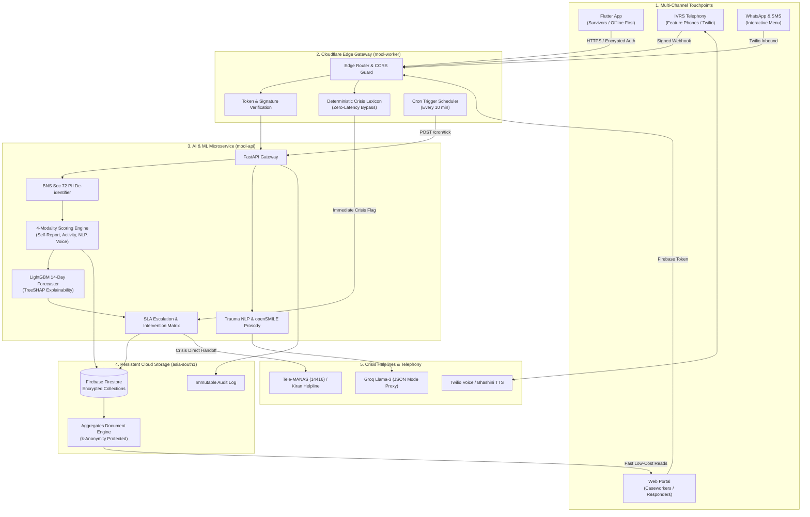
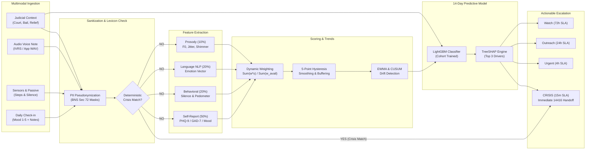
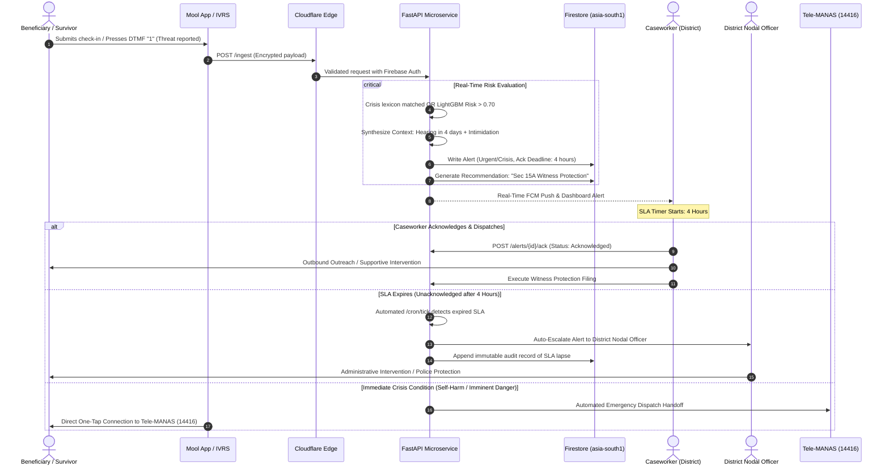

# Mool (मूल) — AI-Powered Grounded Mental Health, Crisis Intervention & Distress Prediction Platform

<p align="center">
  
</p>

<p align="center">
  <strong>Trauma-informed, quiet distress monitoring and proactive crisis intervention connecting vulnerable individuals with human responders before crises escalate.</strong>
</p>

<p align="center">
  <a href="https://github.com/omshree134/mool/releases/latest"></a>
  <a href="https://github.com/omshree134/mool/actions"></a>
  <a href="https://flutter.dev"></a>
  <a href="https://react.dev"></a>
  <a href="https://fastapi.tiangolo.com"></a>
  <a href="https://workers.cloudflare.com"></a>
  <a href="https://lightgbm.readthedocs.io"></a>
  <a href="https://opensource.org/licenses/MIT"></a>
</p>

---

## Table of Contents

- [Overview & Philosophy](#overview--philosophy)
- [Download Mobile App (Android APK)](#download-mobile-app-android-apk)
- [System Architecture](#system-architecture)
- [AI & Distress Prediction Pipeline](#ai--distress-prediction-pipeline)
- [Crisis & SLA Escalation Workflow](#crisis--sla-escalation-workflow)
- [Monorepo Structure](#monorepo-structure)
- [Core Modules Breakdown](#core-modules-breakdown)
  - [1. Mobile Client (mool)](#1-mobile-client-mool)
  - [2. Command Center Portal (mool-web)](#2-command-center-portal-mool-web)
  - [3. Edge Gateway & Router (mool-worker)](#3-edge-gateway--router-mool-worker)
  - [4. AI & ML Microservice (mool-api)](#4-ai--ml-microservice-mool-api)
- [Mathematical & Algorithmic Framework](#mathematical--algorithmic-framework)
  - [Dynamic 4-Modality Scoring Formula](#dynamic-4-modality-scoring-formula)
  - [Trend Analysis: EWMA & CUSUM](#trend-analysis-ewma--cusum-drift-detection)
  - [LightGBM 14-Day Risk Forecasting](#lightgbm-14-day-risk-forecasting)
- [SLA Escalation & Intervention Matrix](#sla-escalation--intervention-matrix)
- [API Endpoints Reference](#api-endpoints-reference)
- [Design System & Trauma-Informed Tokens](#design-system--trauma-informed-tokens)
- [Security, Privacy & Legal Compliance](#security-privacy--legal-compliance)
- [Installation & Local Setup](#installation--local-setup)
- [License & Acknowledgements](#license--acknowledgements)

---

## Overview & Philosophy

**Mool** (*"मूल"* — meaning *root* or *foundation* in Sanskrit and Hindi) is an AI-powered mental health monitoring, distress forecasting, and crisis escalation ecosystem. It is engineered with strict **trauma-informed care** principles, designed for survivors of atrocities, domestic violence, human rights violations, and vulnerable citizens navigating complex legal and social stressors (such as the SC/ST Prevention of Atrocities Act and criminal justice proceedings).

### Why Mool?

Traditional mental health apps are clinical, demanding, and surveillant:
1. **Surveillance Anxiety**: Rigid questionnaires and high-frequency alerts cause users to withdraw out of fear of state intrusion or institutionalization.
2. **Delayed Intervention**: Crisis helplines operate reactively after someone is already in acute danger, rather than identifying warning indicators days earlier.
3. **The Digital Divide**: Rural and marginalized citizens often lack high-end smartphones and stable internet, excluding them from smartphone-only digital health platforms.
4. **Legal & Context Blindness**: Existing tools evaluate psychological distress in a vacuum, ignoring external compounding catalysts such as upcoming court bail hearings, witness intimidation, or delayed victim compensation relief.

**Mool bridges this gap by unifying:**
- **Zero-Friction, Calming Interfaces**: A soothing, humanist UI using grounding sensory exercises, audio sanctuaries, and local-first encryption.
- **Multimodal Sensing**: 4 data modalities (self-report check-ins, behavioral activity/silence tracking, trauma-informed NLP emotion extraction, and acoustic prosody).
- **Proactive 14-Day Forecasting**: Predictive LightGBM ML models that forecast acute distress spikes up to 14 days in advance with TreeSHAP explainability.
- **Inclusive Accessibility**: IVRS interactive voice calls and WhatsApp channels for non-smartphone users.
- **Automated Human-in-the-Loop SLAs**: Deterministic escalation matrix routing cases from Caseworkers to Nodal Officers and the Tele-MANAS national helpline (14416).

---

## Download Mobile App (Android APK)

The compiled, production-ready release APK is available directly in [**GitHub Releases**](https://github.com/omshree134/mool/releases/latest).

| Attribute | Specification |
|---|---|
| **Package** | `app-release.apk` |
| **Download Link** | [**Download Latest APK Release**](https://github.com/omshree134/mool/releases/latest) |
| **Minimum OS** | Android 8.0 (API Level 26) or higher |
| **Target OS** | Android 14 (API Level 34) |
| **Architecture** | Universal APK (`armeabi-v7a`, `arm64-v8a`, `x86_64`) |
| **Offline Support** | Local Hive database with offline-first event synchronization |

---

## System Architecture

The platform follows a resilient distributed architecture combining edge routing, a local-first mobile client, a centralized reactive command portal, an ML analytics backend, and telephony infrastructure.



---

## AI & Distress Prediction Pipeline

The diagram below details the journey of inbound data—from user interaction and silence tracking through multimodal feature extraction, LightGBM forecasting, and human-in-the-loop SLA triage:



---

## Crisis & SLA Escalation Workflow

When an acute crisis signal or high-risk legal trigger occurs (such as an intimidation threat 48 hours prior to an accused person's bail hearing), Mool activates an automated, time-bound escalation sequence:



---

## Monorepo Structure

```
Mool/
├── mool/                   # Mobile Client (Flutter v3.24+, Android & iOS)
│   ├── android/            # Native Android Gradle configuration & permissions
│   ├── ios/                # Native iOS Runner configuration
│   ├── lib/
│   │   ├── app/            # App routing, themes, state management
│   │   ├── core/           # Constants, design tokens, crypto utilities
│   │   ├── models/         # Beneficiary, check-in, screener & case models
│   │   ├── services/       # AI client, audio, local Hive DB, sensors, sync
│   │   └── ui/             # 25+ trauma-informed screens & somatic widgets
│   └── pubspec.yaml        # Flutter dependencies & assets
│
├── mool-web/               # Web Command Center (React 18 + TypeScript + Vite)
│   ├── src/
│   │   ├── components/     # Dashboards, Triage Queue, Case Timeline, Modals
│   │   │   ├── portal/     # DistressAlertsQueue, BeneficiaryManager, CaseView
│   │   │   ├── simulator/  # Interactive IVRS Phone Dialing Simulator
│   │   │   └── common/     # Reusable design token cards, buttons, badges
│   │   ├── context/        # Auth, Role-Based Access Control (RBAC) state
│   │   ├── lib/            # Firebase SDK client, firestore rules, helpers
│   │   ├── services/       # Aggregates, AI API connector, MHQA RAG query
│   │   └── types/          # TypeScript interfaces for cases, alerts, logs
│   ├── vite.config.ts      # Vite build configuration
│   └── package.json        # Node dependencies & build scripts
│
├── mool-worker/            # Edge Gateway (Cloudflare Workers + TypeScript)
│   ├── src/
│   │   ├── index.ts        # Fast edge routing, reverse proxy, CORS policy
│   │   ├── crisis.ts       # Zero-latency deterministic crisis lexicon filter
│   │   ├── firestore.ts    # Edge-level low-overhead Firestore REST client
│   │   └── twilio.ts       # Cryptographic webhook signature verification
│   ├── wrangler.toml       # Cloudflare deployment & cron schedule triggers
│   └── package.json        # Wrangler & edge runtime dependencies
│
└── mool-api/               # ML & Analytics Microservice (FastAPI + Python 3.10)
    ├── app/
    │   ├── main.py         # FastAPI application entrypoint & middleware
    │   ├── deps.py         # Firebase Admin Token validator & RBAC checks
    │   ├── engine/         # Scoring engine, trend analysis, LightGBM forecast
    │   ├── nlp/            # BNS Sec 72 pseudonymizer, emotion AI, lexicon
    │   ├── voice/          # ASR transcription (Whisper/Bhashini) & openSMILE
    │   └── routers/        # Ingest, AI proxy, alerts, recommendations, cron
    ├── config/             # YAML configurations: escalation SLAs, interventions
    ├── models/             # Pre-trained LightGBM distress forecast model
    ├── scripts/            # Synthetic cohort generation & model training
    ├── Dockerfile          # Production containerization
    ├── render.yaml         # Render cloud deployment blueprint
    └── requirements.txt    # Python machine learning & web dependencies
```

---

## Core Modules Breakdown

### 1. Mobile Client (`mool`)
Built with Flutter for high accessibility, complete offline autonomy, and local-first encryption:
- **Trauma-Informed Onboarding**: Anonymous setup with QR token pairing; no mandatory phone number or PII required.
- **Gentle Check-ins**: Multilingual sentiment, 1–5 emotional grounding slider, free-form reflection journal, and optional 45-second audio note.
- **Talk to Mool**: Trauma-informed AI companion grounded in clinical empathy, backed by the AIKosh MHQA dataset.
- **Somatic Grounding Tools**: Interactive 5-4-3-2-1 sensory awareness tool, paced box breathing animations, and binaural nature soundscapes.
- **Court & Legal Companion**: Track court hearing schedules, bail hearings, witness protection rights, and SC/ST PoA Act statutory entitlements.
- **Victim Compensation Tracker**: Track stage-wise legal compensation disbursements across DLSA and SLSA tiers.
- **Stealth & Safety Features**: Biometric / PIN stealth lock disguised as an operational calculator decoy; local AES-256 encrypted Evidence Vault for incident audio and photos.
- **Crisis SOS Beacon**: Instant one-tap dispatch connecting directly with emergency caseworkers and Tele-MANAS (14416).
- **IVRS Simulator**: In-app telephone dialer to demonstrate and test voice check-in flows without active cellular airtime.

### 2. Command Center Portal (`mool-web`)
Built with React 18, TypeScript, and Vite for clinical caseworkers and government nodal officers:
- **Role-Based Access Control (RBAC)**: Distinct permissions for Caseworkers, District Officers, State Nodal Officers, and System Administrators.
- **Real-Time Distress Triage Queue**: Sorts cases by predictive risk score and SLA urgency; allows one-click triage workflows (**Acknowledge**, **Escalate**, **Dispatch Field Support**, **Close**).
- **Longitudinal Case Timeline**: Complete historical view of a survivor's distress trajectory, hearing milestones, compensation status, and past check-ins.
- **Explainable AI (XAI) Recommendations**: Contextual intervention cards explaining *why* an alert fired (e.g., *"Intimidation reported 36h ago + Accused bail hearing in 4 days"*).
- **Privacy-Preserving Aggregates**: District, State, and National heatmaps and charts; automatically applies **k-anonymity** (suppressing any cell count $< 5$ to prevent deanonymization).
- **IVRS Telephone Simulator**: Full browser-based phone handset simulator for testing inbound voice prompts, DTMF tones, and recording pipelines.
- **Immutable Audit Logging**: Every view, note, and status update is logged with cryptographic actor timestamps.

### 3. Edge Gateway & Router (`mool-worker`)
Deployed across Cloudflare’s global edge network:
- **Sub-50ms Response Latency**: Routes mobile and web API traffic with low overhead.
- **Deterministic Crisis Interceptor**: Scans incoming text against a clinician-reviewed crisis lexicon at the edge. If matched, it immediately triggers the crisis protocol without waiting for downstream LLM inference.
- **Webhook Signature Security**: Authenticates Twilio IVRS and WhatsApp requests using HMAC-SHA1 signatures.
- **Automated Cron Scheduler**: Executes scheduled tasks every 10 minutes (`POST /cron/tick`) to monitor SLA deadlines and trigger automated escalations.

### 4. AI & ML Microservice (`mool-api`)
FastAPI service orchestrating machine learning inference and clinical workflows:
- **LightGBM Distress Forecaster**: Evaluates longitudinal trends, legal event proximity, and behavioral signals to predict acute distress escalation probability over the next 14 days.
- **TreeSHAP Explainability**: Decomposes model predictions into constituent risk drivers for complete transparency.
- **Voice Stress Prosody**: Extracts acoustic functionals using `openSMILE` (eGeMAPSv02 feature set) including pitch variation ($F_0$), local jitter, local shimmer, and unvoiced pauses.
- **BNS Section 72 PII Pseudonymization**: De-identifies names, locations, contact numbers, and FIR IDs before third-party LLM processing to comply with Indian privacy statutes.
- **Trauma-Informed NLP**: Extracts nuanced multi-label emotion vectors (fear, sadness, anger, hopelessness, shame, calm) using structured JSON output schemas.

---

## Mathematical & Algorithmic Framework

### Dynamic 4-Modality Scoring Formula

The Mool scoring engine dynamically adjusts weights when individual modalities are unavailable (e.g., if a user does not submit voice audio or disabled accelerometer permissions). No missing feature is ever treated as zero.

$$\text{Final Distress Score } S = \frac{\sum_{m \in \mathcal{M}_{\text{avail}}} w_m \cdot s_m}{\sum_{m \in \mathcal{M}_{\text{avail}}} w_m} + \Delta_{\text{context}}$$

Where the baseline modality weights $w_m$ are:

| Modality ($m$) | Baseline Weight ($w_m$) | Measurement Indicators |
|---|:---:|---|
| **Self-Report** | **0.50** | Daily mood (1–5 scale), PHQ-9, GAD-7 screener responses |
| **Behavior & Activity** | **0.20** | Pedometer compliance, silence duration ($> 5$ days silence = auto-trigger) |
| **Language NLP** | **0.20** | Fear, sadness, anger, hopelessness, shame emotion weights |
| **Acoustic Prosody** | **0.10** | Normalized baseline z-scores for $F_0$ pitch variance, jitter, shimmer |

#### Contextual Modifier ($\Delta_{\text{context}}$)
External judicial catalysts apply additive offsets:
- $\Delta = +25$: Verified intimidation event within preceding 48 hours.
- $\Delta = +15$: Accused bail hearing scheduled within 5 days.
- $\Delta = +10$: Overdue victim compensation installment ($> 30$ days).

#### 5-Point Hysteresis Smoothing
To prevent alert oscillation around tier thresholds, transitions require crossing a 5-point hysteresis buffer:
- Upward escalation: $S_{\text{new}} \ge \text{Threshold}$
- Downward de-escalation: $S_{\text{new}} < (\text{Threshold} - 5)$

---

### Trend Analysis: EWMA & CUSUM Drift Detection

Mool smooths daily noise using an Exponentially Weighted Moving Average (EWMA) and detects subtle, sustained upward distress drift using Cumulative Sum (CUSUM) control charts:

$$\text{EWMA}_t = \alpha \cdot S_t + (1 - \alpha) \cdot \text{EWMA}_{t-1} \quad (\alpha = 0.30)$$

$$\text{CUSUM}_t^+ = \max\left(0, \;\text{CUSUM}_{t-1}^+ + \frac{S_t - \mu}{\sigma} - k\right)$$

When $\text{CUSUM}_t^+ > h$ ($k = 0.5, h = 4.0$), an automated **"Rising Trend"** Watch alert is generated, even if the absolute distress score remains in the moderate tier.

---

### LightGBM 14-Day Risk Forecasting

The LightGBM binary classifier predicts whether a beneficiary will escalate to **Urgent** or **Crisis** status within the subsequent 14 days.

```
P(Escalation in 14d) = LightGBM( X_features )
```

**Feature Space ($X_{\text{features}}$):**
1. Longitudinal Distress: $S_{\text{current}}$, $\text{EWMA}_{7}$, $\text{EWMA}_{14}$, 7-day slope, 14-day slope.
2. Judicial Events: Days until next hearing, days until bail hearing, days since intimidation incident.
3. Administrative Factors: Compensation delay in days, number of consecutive missed check-ins.
4. Multimodal Signals: Mean pitch z-score, hopelessness score, fear score.

**TreeSHAP Integration**: Output includes the top 3 contributing factors, providing caseworkers with interpretable explanations:
> *"Risk probability: 0.74 — Main drivers: Bail hearing in 3 days (+0.24), sustained upward slope (+0.18), 3 consecutive missed check-ins (+0.11)."*

---

## SLA Escalation & Intervention Matrix

| Tier | Score Range | SLA Acknowledgment Window | Notification Targets | Automated Interventions & Safeguards |
|:---:|:---:|:---:|---|---|
| **Watch** | 0 – 39 | **72 Hours** | Primary Caseworker | Weekly gentle check-in prompt; passive activity monitoring |
| **Outreach** | 40 – 69 | **24 Hours** | Caseworker, District Nodal Officer | Proactive IVRS call trigger; compensation review flag |
| **Urgent** | 70 – 84 | **4 Hours** | Caseworker, Nodal Officer, DMHP Clinical Team | In-person caseworker visit; witness protection assessment |
| **CRISIS** | 85 – 100 | **15 Minutes** | Crisis Desk, Emergency Response, SP Office | Direct handoff to **Tele-MANAS (14416)**; active distress beacon |

### SLA Escalation Hierarchy (If Unacknowledged)
If an alert is not acknowledged within its SLA window, the background cron worker automatically escalates authority:

```
Caseworker (L1) ──[SLA Breached]──> District Nodal Officer (L2) ──[SLA Breached]──> District Magistrate (L3) ──> State Nodal Officer (L4)
```

### Actionable Intervention Catalog

- **Witness Protection (Sec 15A)**: Triggered when an intimidation report occurs within 7 days of a court hearing. Automatically drafts a Witness Protection Scheme application.
- **Compensation Expediting**: Triggered when statutory victim compensation relief is overdue by $> 7$ days. Notifies the District Legal Services Authority (DLSA).
- **Clinical Referral**: Triggered by positive PHQ-9 Item 9 (suicidal ideation) or severe depression indicators. Routes case to District Mental Health Programme (DMHP).

---

## API Endpoints Reference

The FastAPI microservice exposes fully documented endpoints with interactive Swagger UI at `/docs`:

| Method | Endpoint | Description | Auth Required |
|---|---|---|:---:|
| `GET` | `/` | Microservice health check & version info | No |
| `POST` | `/ai/chat` | Trauma-informed AI companion proxy (BNS Sec 72 de-identified) | Yes |
| `POST` | `/ingest` | Multi-channel ingestion (app, IVRS, WhatsApp, notes) | Yes |
| `POST` | `/forecast/predict` | 14-day distress risk prediction with TreeSHAP explanations | Yes |
| `GET` | `/alerts` | Query active triage alerts by district, tier, and status | Yes (RBAC) |
| `POST` | `/alerts/{id}/ack` | Acknowledge alert and log caseworker triage actions | Yes (RBAC) |
| `GET` | `/recommendations` | Explainable intervention recommendations for a beneficiary | Yes (RBAC) |
| `GET` | `/aggregates/summary` | Privacy-preserved macro wellbeing rollups ($k \ge 5$) | Yes (RBAC) |
| `POST` | `/ivrs/twiml` | Generates TwiML voice response flows for telephony callers | Signed Webhook |
| `POST` | `/cron/tick` | Heartbeat tick for SLA expiration audits and trend rollups | Secret Header |

---

## Design System & Trauma-Informed Tokens

Mool avoids aggressive SaaS tropes (pure harsh blacks, neon accents, clinical starkness). The palette is inspired by **soil, roots, and calming daylight**:

| CSS Variable | Hex Code | Visual Swatch | Semantic Function |
|---|:---:|:---:|---|
| `--mool-linen` | `#F6F3EC` |  | Soft, warm off-white canvas (low eye fatigue) |
| `--mool-moss` | `#5F7A5E` |  | Primary organic brand accent; grounding elements |
| `--mool-dusk` | `#2E4452` |  | Deep indigo-slate; responder portal navigation & authority |
| `--mool-sandrose` | `#C98B76` |  | Empathetic warmth; interactive touchpoints and buttons |
| `--mool-ink` | `#2B2B28` |  | Soft charcoal body typography (never harsh `#000000`) |
| `--mool-mist` | `#E4E0D5` |  | Card surfaces, container borders, and divider lines |
| `--mool-signal` | `#B3543F` |  | Muted terracotta distress indicator (non-triggering) |

**Typography**:
- **Display Serif**: *Fraunces* (soft humanist variable serif) for comforting headers and grounding prompts.
- **Interface Sans**: *Inter* (geometric, legible grotesk) for high legibility across mobile forms and dense desktop triage tables.

---

## Security, Privacy & Legal Compliance

1. **BNS Section 72 & POCSO Compliance**:
   - Bharatiya Nyaya Sanhita (BNS) Section 72 prohibits disclosing the identity of victims of certain offenses.
   - Mool implements client-side and edge-level pseudonymization: real names, phone numbers, addresses, and police FIR numbers are replaced with cryptographically salted tokens before any LLM inference or cross-network transmission.
2. **Local-First & Default-Deny Security**:
   - The survivor's sensitive audio notes, diary entries, and evidence vault files are stored with AES-256 encryption on-device.
   - Firestore security rules implement a strict default-deny policy. Beneficiary phone numbers reside in an isolated `contact_private/` collection with zero client-read permissions.
3. **k-Anonymity Privacy Guarantee**:
   - In regional and national analytical dashboards, aggregate cohort counts smaller than 5 ($k < 5$) are suppressed to prevent re-identification through demographic deduction.
4. **Witness Protection Scheme (WPS 2018)**:
   - Built-in alignment with the Hon'ble Supreme Court of India's Witness Protection Scheme 2018, facilitating rapid protective filings upon detected intimidation.
5. **No Embedded Secret Keys**:
   - All production keys, Twilio credentials, and Firebase service accounts reside exclusively in server-side environment secrets.

---

## Installation & Local Setup

### Prerequisites
- **Flutter SDK**: v3.24+
- **Node.js**: v18+ & `npm`
- **Python**: v3.10+
- **Android Studio / Android SDK**: API Level 34+

---

### 1. Mobile App (`mool`)

```bash
cd mool

# Install Flutter dependencies
flutter pub get

# Run on connected Android device or emulator
flutter run

# Build production release APK
flutter build apk --release
```

*Note: For Firebase mobile setup, copy your Firebase config to `mool/android/app/google-services.json`.*

---

### 2. Web Command Center (`mool-web`)

```bash
cd mool-web

# Install npm packages
npm install

# Copy environment template
cp .env.example .env.local

# Run Vite development server
npm run dev
```
Open [http://localhost:5173](http://localhost:5173) in your browser.

---

### 3. Edge Worker Gateway (`mool-worker`)

```bash
cd mool-worker

# Install dependencies
npm install

# Start local Cloudflare Wrangler dev server
npm run dev
```

To deploy to Cloudflare:
```bash
npx wrangler deploy
```

---

### 4. AI & ML Microservice (`mool-api`)

```bash
cd mool-api

# Create Python virtual environment
python -m venv venv
# Windows:
.\venv\Scripts\activate
# Linux/macOS:
source venv/bin/activate

# Install requirements
pip install -r requirements.txt

# Start FastAPI server with live reload
uvicorn app.main:app --reload --port 7860
```
Access the interactive API documentation at [http://localhost:7860/docs](http://localhost:7860/docs).

---

## License & Acknowledgements

- **License**: Released under the open-source [**MIT License**](https://opensource.org/licenses/MIT).
- **Dataset Integration**: Grounded conversational responses utilize the **AIKosh Bharat Mental Health QA (MHQA)** repository.
- **Emergency Helplines**: Tele-MANAS (Tele Mental Health Assistance and Networking Across States — `14416`) and Kiran National Mental Health Helpline (`1800-599-0019`).
- **Author**: Built with dedication by **Team Origin**.
